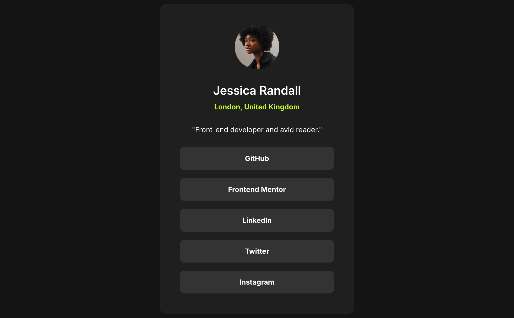
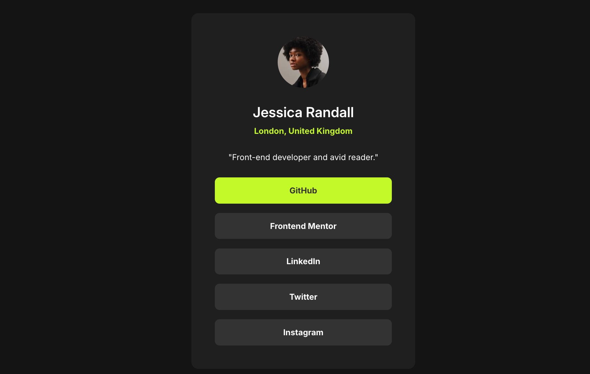

# Frontend Mentor - Social links profile solution

This is a solution to the [Social links profile challenge on Frontend Mentor](https://www.frontendmentor.io/challenges/social-links-profile-UG32l9m6dQ).

## Table of contents

- [Overview](#overview)
  - [The challenge](#the-challenge)
  - [Screenshot](#screenshot)
  - [Links](#links)
- [My process](#my-process)
  - [Built with](#built-with)
  - [What I learned](#what-i-learned) 
  - [AI Collaboration](#ai-collaboration)
- [Author](#author)


## Overview

### The challenge

Users should be able to:

- See hover and focus states for all interactive elements on the page

### Screenshot





### Links

- Solution URL: [GitHub](https://github.com/UNGVSN/social-links-profile.git)
- Live Site URL: [Netlify](https://social-links-profile-00.netlify.app/)

## My process

### Built with

- Semantic HTML5 markup
- CSS custom properties
- Flexbox

### What I learned

I think using `<hgroup>` was a good use of semantic HTML :

```html
 <hgroup>
  <h1>Jessica Randall</h1>
  <p>London, United Kingdom</p>
</hgroup>
```
My `@media` query was able to declare styles for both tablets at `48rem` and desktops at `90rem` :

```css
@media (min-width: 48rem) {
    body {
        padding-inline: var(--spacing-500);
    }
    main {
        max-inline-size: calc(384/16 * 1rem);
    }

    article {
        padding: var(--spacing-500);
    }
}
```

### AI Collaboration

I used WebStorm's AI Assistant feature to get an assessment of my designs at various stages of the challenge. It was 
able to connect to the Figma Desktop MCP server and give me precise information when requested to do so. It also 
went beyond the design/style guide provided and suggested features for accessibility reasons.

## Author

- Frontend Mentor - [@UNGVSN](https://www.frontendmentor.io/profile/ungvsn)

